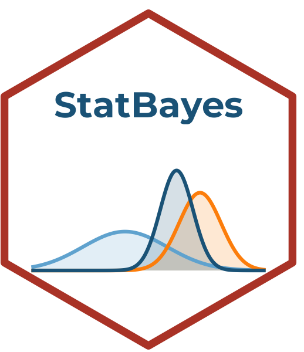

# StatBayes 

<!-- badges: start -->


<!-- badges: end -->

**StatBayes** is an interactive and didactic Shiny application for applied
Bayesian analysis, developed at
[ICOMVIS](https://icomvis.una.ac.cr/), Universidad Nacional de Costa Rica.
Part of the **StatSuite** ecosystem.

The app interface is in Spanish, targeting Spanish-speaking students and
researchers in ecology and conservation.

---

## Modules

| Module | Description |
|---|---|
| 🎚️ **Prior distributions** | What priors are, how to choose them, prior predictive check |
| 📈 **Bayesian linear regression** | Bayesian equivalent of LM using `brms` |
| 🔀 **Bayesian GLM** | Binomial, Poisson, negative binomial families |
| 〰️ **Bayesian GAM** | Bayesian splines with `brms` |
| 🔗 **Bayesian mixed models** | Random effects with `brms` |
| 📊 **MCMC diagnostics** | Rhat, ESS, traceplots, divergences |
| 🏆 **Model comparison** | LOO, WAIC, Bayes Factor |

---

## R ecosystem

StatBayes is built on:

- [`brms`](https://paul-buerkner.github.io/brms/) — Bayesian models via Stan
- [`bayesplot`](https://mc-stan.org/bayesplot/) — posterior and MCMC visualization
- [`posterior`](https://mc-stan.org/posterior/) — draws manipulation
- [`loo`](https://mc-stan.org/loo/) — approximate leave-one-out cross-validation
- [`tidybayes`](https://mjskay.github.io/tidybayes/) — tidy workflow for Bayesian models
- [`parameters`](https://easystats.github.io/parameters/) + [`performance`](https://easystats.github.io/performance/) — model summary and diagnostics

---

## Installation

> Requires a working Stan installation via `cmdstanr` or `rstan`.

```r
# Install StatBayes from GitHub
# install.packages("remotes")
remotes::install_github("ManuelSpinola/StatBayes")
```

## Usage

```r
library(StatBayes)
run_app()
```

---

## Part of StatSuite

| App | Description |
|---|---|
| **StatDesign** | Study design and sampling |
| **StatFlow** | Exploratory analysis and visualization |
| **StatGeo** | Spatial analysis and maps |
| **StatMonitor** | Population monitoring |
| **StatModels** | Frequentist statistical models |
| **StatBayes** | Bayesian analysis ← here |

---

## Author

**Manuel Spinola** · ICOMVIS, Universidad Nacional de Costa Rica  
✉️ manuel.spinola@una.ac.cr

Developed with assistance from **Claude (Anthropic)**.
